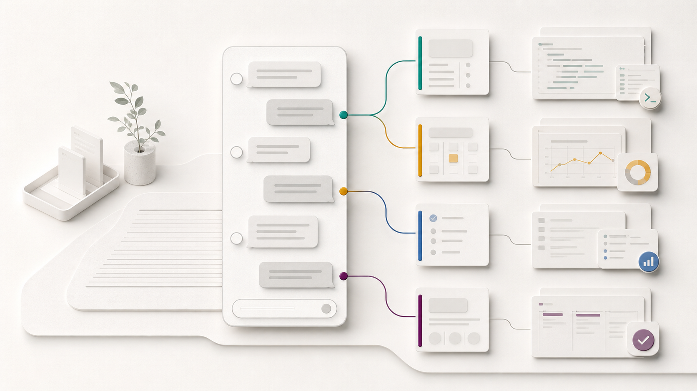
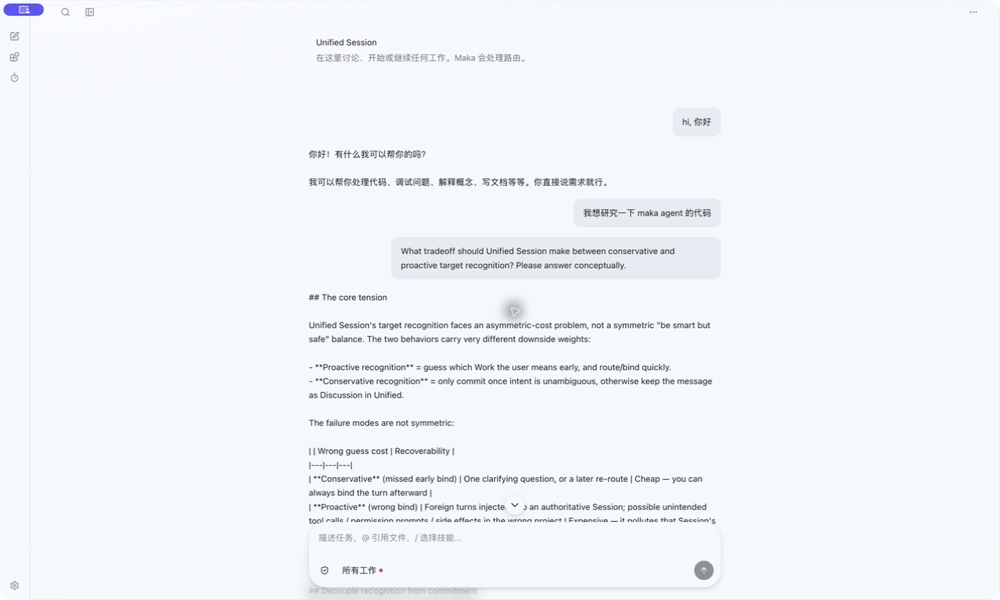
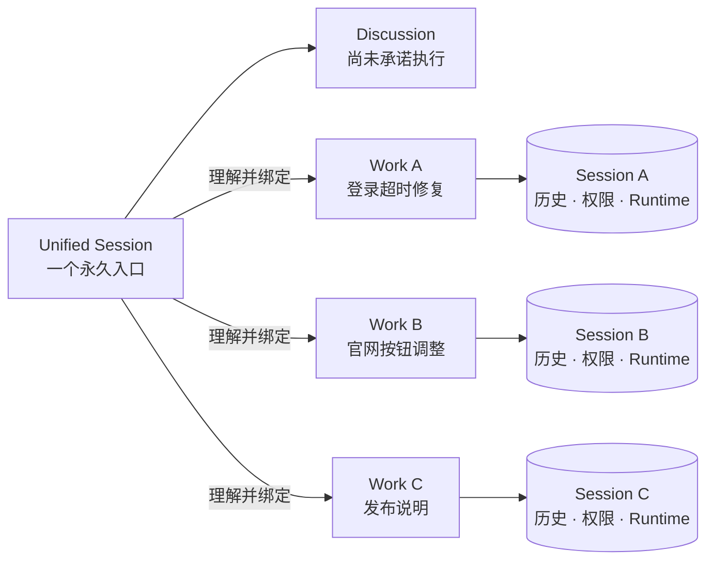
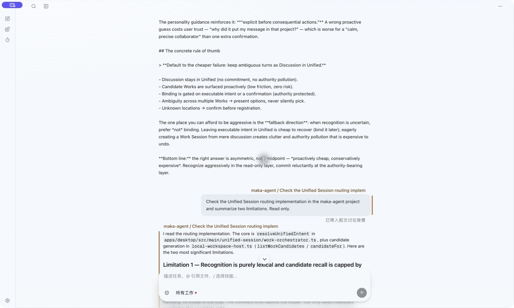
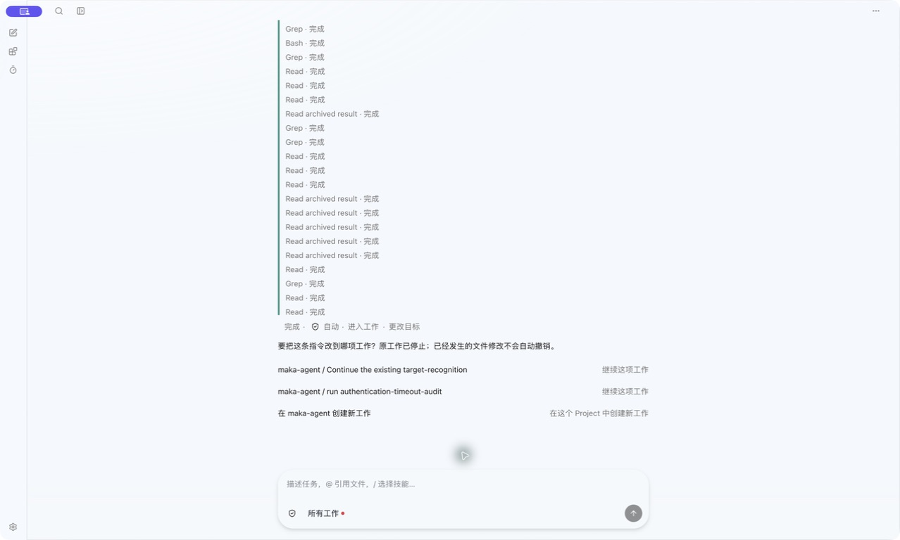
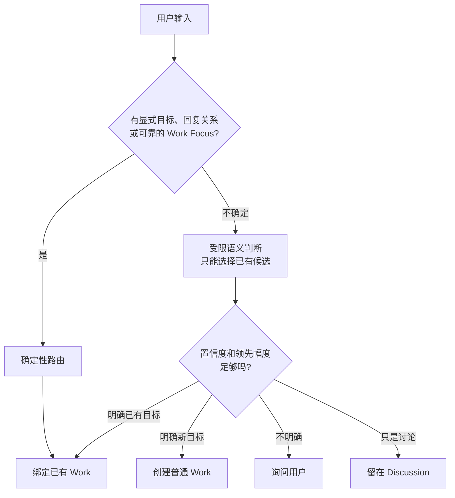
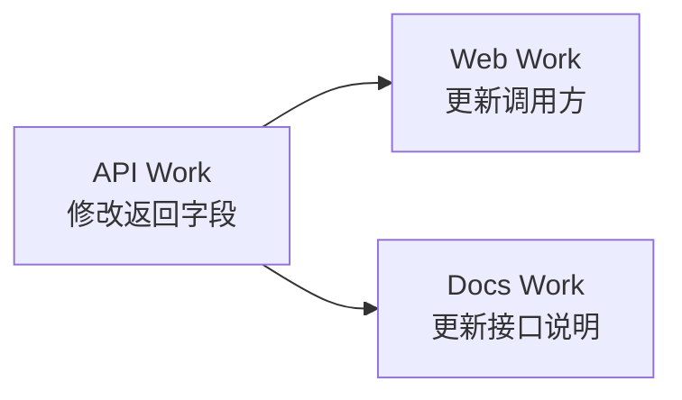

# 一个入口，但不是一个超级会话



> **Unified Session** 是 Maka 的实验性全局工作入口：用户只需要表达意图，Maka 负责理解他正在谈论哪项工作，并把输入交给正确的 Session。

单文件分享版：[下载图文 PDF](./output/pdf/unified-session-experiment.zh-CN.pdf)

我们想解决的不是“如何把更多聊天塞进一个窗口”，而是一个更日常的问题：

> 当一个人同时推进多个项目时，为什么还要由他记住应该切到哪个 Session，才能说下一句话？

这个实验最本质的目的，是尽量减少用户管理 Session、切换 Project、重新进入上下文的心智负担。用户应该在一个地方管理所有工作，而不需要实际关心背后究竟有几个 Session、它们分别在哪里运行。

对用户来说，入口始终是同一个：

- 想知道情况时，可以直接问“现在手头有哪些工作？”；
- 想了解进度时，可以直接问“登录问题处理到哪里了？”；
- 想继续推进时，可以直接说“继续刚才那项工作”；
- 想同时处理多件事时，可以在同一个地方安排、确认和跟进。



*实际运行界面：Unified 保持普通 Session 的消息流和 Composer；侧栏默认收起，但用户仍可随时进入具体 Session。*

Session 仍然存在，但它逐渐退到产品内部，成为承载上下文、权限和执行状态的基础设施，而不是用户每天必须维护的信息架构。

## 理念

理想状态下，用户面对的不是一棵需要维护的 Session 树，而是一位了解他手头工作的协作者。

- 想讨论时，直接讨论，不急着创建工作；
- 目标明确时，自动创建或继续对应的 Work；
- 说“继续那个登录问题”时，系统应尽量理解“那个”指什么；
- 想了解全局时，直接询问所有工作的状态，不必逐个打开检查；
- 想推动多项工作时，在同一个入口安排优先级、依赖和下一步；
- 如果错误绑定可能带来文件修改或外部副作用，宁可追问一次，也不要自信地猜错；
- 用户随时可以进入任何普通 Session，查看完整历史、权限、工具和运行状态。

这里刻意弱化了 **Session**，强化了 **Work**：用户关心的是“登录超时修复”有没有完成，而不是它内部对应哪个 Session ID。

## 它是什么

Unified Session 更像一个 **Work Orchestrator**。



Unified 负责理解、协调和投影；每个目标 Session 仍然拥有自己的：

- 完整对话历史；
- 模型与权限模式；
- Project、工作目录和文件边界；
- 工具调用、Artifact 与 Runtime 事实；
- 中断恢复和删除语义。

## 它不是什么

它不是一个吞掉所有上下文的“超级 Session”。

我们没有把所有 transcript 合并进同一个上下文窗口，也没有让一个永不结束的 Agent 自动获得所有项目的权限。这样做看似无缝，实际上会让上下文、权限、恢复和删除变得不可解释。

Unified 的无缝来自**不需要用户管理路由**，而不是抹掉工作之间的边界。

## 用户看到什么

用户输入一句话后，会发生三种典型结果。

### 1. 继续讨论

> “登录超时可能和刷新令牌有关吗？”

这仍是一段 Discussion。系统直接回答，不急着创建新的 Work。

### 2. 自动形成或继续工作

> “检查登录超时并修掉。”

系统识别 Project 和已有 Work；如果没有合适目标，就创建一个普通 Session。回答仍显示在 Unified 中，同时绑定到目标 Work。



*实际运行界面：识别完成后显示 Project / Work；消息仍沿用普通 Session 的中性气泡，只用同色侧边标记提示工作归属。*

### 3. 先确认目标

> “把那个问题修一下。”

当多个候选接近，或者目标关系到文件修改，系统展示一个轻量选择卡片。用户确认后再执行。



*实际运行界面：目标存在歧义或用户主动更改目标时，可以继续已有 Work，也可以在对应 Project 中创建新 Work。*



模型在这里不是一个可以自由发明 Session 的路由器。它只接收有界、匿名的候选 ID；低置信度、非法目标或近似平局都会退回澄清。

## 为什么消息旁边只有一条细色标

Unified 的视觉应该仍然像普通 Session，而不是一个全新的管理仪表盘。

- 气泡复用普通 Session 的形态、宽度和留白；
- 消息刚发出时保持普通颜色；
- 识别出目标后，Project / Work 信息贴近气泡出现；
- 同一 Work 的问答使用同一条侧边色标；
- 颜色只用于提示归属，不用整块填充抢夺注意力。

目标不是让用户时刻意识到“我正在使用一个特殊的超级功能”，而是让他自然地发现：自己几乎不再需要操心切换 Session。

## 一个地方掌握并推动所有工作

Unified Session 不只是把消息转发到正确目标。它还应该成为用户理解当前工作状态的共同入口。

用户可以直接询问：

> “现在有哪些工作正在进行？”
>
> “哪些事情在等我决定？”
>
> “这个星期还有什么没有完成？”

系统根据各个 Work 的权威状态给出汇总。用户随后可以继续说：

> “先推动登录问题，官网调整等它完成以后再做。”

这时 Unified 负责把自然语言变成明确的 Work、依赖关系和执行顺序。用户管理的是目标和优先级，而不是窗口、Session 和上下文切换。

## 为什么它对非技术用户更重要

熟悉开发工具的人通常已经习惯 repository、workspace、terminal、thread 和 session，也更容易理解为什么一项工作需要一个独立上下文。但对非计算机背景的用户来说，这些概念不是能力，而是使用成本。

一位普通用户更可能这样描述工作：

- “继续准备下周的旅行”；
- “看看装修预算有没有超支”；
- “把昨天讨论的活动方案再完善一下”；
- “告诉我现在有哪些事情需要决定”。

他不应该先判断这些内容分别属于哪个 Workspace，再找到正确 Session，最后回忆上次对话停在哪里。Unified Session 让产品从“管理一组 AI 对话”转向“与一个了解所有工作的 AI 协作者交流”。

这不是隐藏高级能力。普通 Session 仍然随时可进入；只是大多数用户不再需要先理解底层结构，才能获得可靠的工作连续性。

## 为什么它适合移动端

移动设备尤其不适合频繁浏览侧栏、比较相似的 Session 名称、打开多个上下文再返回。屏幕更小、交互更碎片化，用户往往只想快速知道状态或推动下一步。

因此，移动端可以自然地把 Unified Session 作为主界面：

- 打开应用就面对同一个输入入口；
- 用一句话查询所有工作的进度；
- 在消息流中处理少量真正需要决定的事项；
- 收到完成或阻塞通知后，直接回到对应 Work；
- 只有需要检查细节时，才进入某项工作的 Focused View。

从这个角度看，Unified Session 不只是桌面端增加的一项功能，也可能是 Maka 从“Agent 开发工作台”走向更普遍个人工作入口的一种产品演进。

## 多项工作仍然彼此独立

跨 Project 的请求会先形成一个可确认的执行范围，再使用依赖图协调：



A 完成后才解锁 B；没有依赖的 C 可以独立执行。每项工作拥有自己的消息块、状态、权限卡片和完成通知，不会混进同一个 assistant bubble。

## 当前实验已经做到

- 功能开启后默认进入唯一的 Unified Session，普通 Session 侧栏只是默认收起；
- Discussion、自动创建 Work、恢复已有 Work；
- 基于显式关系、交互状态、词法证据、Work Focus 和受限模型的分层路由；
- 近似平局澄清、用户选择目标、执行中更改目标；
- Project / Work 元信息和低噪音生命周期事件；
- 复用目标 Session 的权限模式与交互卡片；
- 跨 Project 依赖图、确认、取消、失败阻断和重启恢复；
- 归档恢复、删除后的投影级联清理；
- 34 个编排单测与 12 个 Electron 端到端场景。

## 这仍然是一个实验

目前的实现用于验证产品模型和交互，不代表已经完成生产迁移：

- 当前 host composition 覆盖一个 Maka 数据根及其中注册的 Project；真正的多数据根 Workspace 装载仍需继续演进；
- 路由阈值和语义卡片需要通过真实使用校准；
- 实验分支的存储 schema 旧于当前发布版，试用时必须使用隔离的 `userData`，不要直接打开日常数据。

## 试用

```bash
git fetch origin
git switch codex/unified-session-experiment
npm ci
npm run build
MAKA_DEV_USER_DATA_DIR=/tmp/maka-unified-demo npm --workspace @maka/desktop run start
```

启动后，在 `设置 → 通用 → Unified Session` 中开启功能。隔离 profile 需要单独配置模型连接。

实现分支：[`codex/unified-session-experiment`](https://github.com/ARE404/maka-agent/tree/codex/unified-session-experiment)

更完整的设计与边界：

- [架构说明](./docs/architecture/unified-session-work-orchestrator.zh-CN.md)
- [架构决策记录](./docs/adr/0001-unified-session-global-work-orchestrator.md)

---

**一句话总结：** 用户始终面对同一个入口，在一个地方了解并推动所有工作；Session 退到幕后，但每项工作的上下文、权限与可恢复性仍然完整保留。
