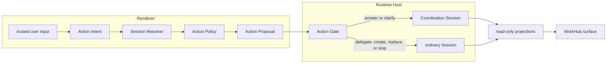

<!--
  Licensed to the Apache Software Foundation (ASF) under one
  or more contributor license agreements.  See the NOTICE file
  distributed with this work for additional information
  regarding copyright ownership.  The ASF licenses this file
  to you under the Apache License, Version 2.0 (the
  "License"); you may not use this file except in compliance
  with the License.  You may obtain a copy of the License at

      http://www.apache.org/licenses/LICENSE-2.0

  Unless required by applicable law or agreed to in writing,
  software distributed under the License is distributed on an
  "AS IS" BASIS, WITHOUT WARRANTIES OR CONDITIONS OF ANY
  KIND, either express or implied.  See the License for the
  specific language governing permissions and limitations
  under the License.
-->

# WorkHub decision and authority architecture

- Status: Current implementation map
- Scope: WorkHub routing, admission, execution, and projection
- Terms: [WorkHub domain language](../workhub-domain-language.md)
- Decision: [WorkHub Coordination Session ADR](./workhub-coordination-session-adr.md)

## One architecture, two questions

WorkHub's decision flow answers how one input becomes an effect. Its authority
layout answers which module may own that effect. They are two views of the same
system, not two architectures.



The canonical flow is:

```text
Action Intent
  -> Session Resolver
  -> Action Policy
  -> Action Proposal
  -> Action Gate
  -> persist / execute
  -> project
```

## Current module map

| Stage | Current module | Responsibility |
|---|---|---|
| Action Intent | [`workhub-creation-intent.ts`](../../packages/core/src/workhub-creation-intent.ts) | Interpret trusted user text without selecting a Session or granting authority. |
| Session Resolver | [`workhub-session-resolver.ts`](../../packages/core/src/workhub-session-resolver.ts) | Recall visible existing ordinary Sessions as candidates, none, or ambiguity. It never returns `create_new`. |
| Action Policy | [`workhub-route-policy.ts`](../../apps/desktop/src/renderer/workhub-route-policy.ts) | Combine intent, recall, transient focus, and action rules into an advisory disposition. Creation is decided here. |
| Action Proposal | [`workhub-coordination.ts`](../../packages/runtime-host/src/protocol/workhub-coordination.ts) | Carry one closed typed proposal. Existing targets use opaque `candidateRef` values. |
| Action Gate | [`workhub-coordination-action-gate.ts`](../../packages/runtime-host/src/server/workhub-coordination-action-gate.ts) | Re-read Host state, validate preconditions, and either admit or reject effects. |
| Projection | [`workhub-coordination-port.ts`](../../apps/desktop/src/renderer/workhub-coordination-port.ts) | Rebuild WorkHub turns and delegation views from authoritative Session facts. |

The renderer's controller and adapters order requests and transport these typed
values. They are not execution authorities.

## Authority invariants

1. The active Runtime Host owns one stable Coordination Session. It owns WorkHub
   discussion, clarification, decisions, and delegation links.
2. Each ordinary Session owns its execution transcript, runtime, permissions,
   artifacts, lifecycle, and recovery.
3. WorkHub cards and statuses are rebuildable projections; they own no durable
   execution facts.
4. Intent, recall, policy, model output, and proposals are advisory. Only the
   Runtime Host Action Gate may admit a write.
5. The Action Gate revalidates current Host-owned state. A Session id, candidate
   ranking, or stale projection cannot authorize an effect.

## Gate semantics

Privacy, visibility, ambiguity, and action-specific rules constrain earlier
stages so unsafe proposals are less likely. Those checks do not grant authority.
The Runtime Host Action Gate remains the single admission seam between a proposal
and persistence or execution.

This map describes the current per-Runtime-Host architecture. Decision tracing,
global orchestration, and cross-Host coordination require separate decisions and
are intentionally not designed here.
