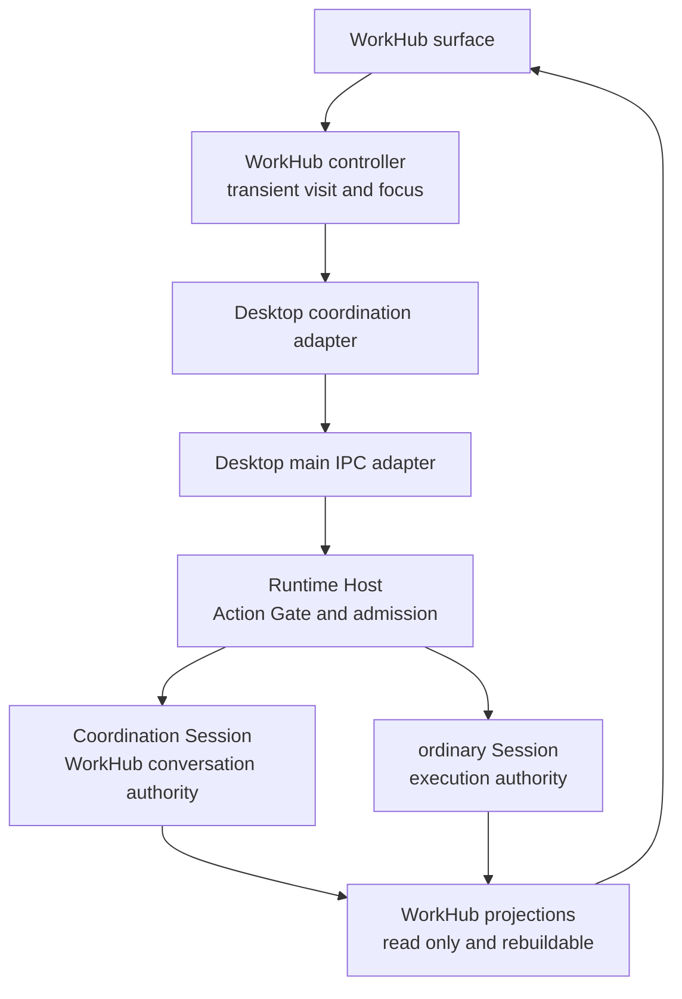
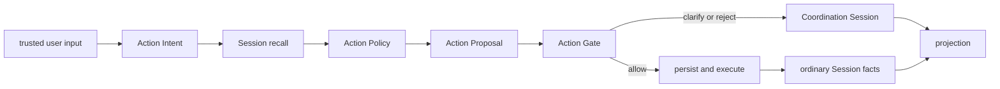

<!--
  Licensed to the Apache Software Foundation (ASF) under one
  or more contributor license agreements.  See the NOTICE file
  distributed with this work for additional information
  regarding copyright ownership.  The ASF licenses this file
  to you under the Apache License, Version 2.0 (the
  "License"); you may not use this file except in compliance
  with the License.  You may obtain a copy of the License at

      http://www.apache.org/licenses/LICENSE-2.0

  Unless required by applicable law or agreed to in writing,
  software distributed under the License is distributed on an
  "AS IS" BASIS, WITHOUT WARRANTIES OR CONDITIONS OF ANY
  KIND, either express or implied.  See the License for the
  specific language governing permissions and limitations
  under the License.
-->

# WorkHub decision and authority architecture

- Status: Current implementation map and target seam clarification
- Scope: WorkHub routing, admission, execution, and projection
- Related decisions: [WorkHub Coordination Session ADR](./workhub-coordination-session-adr.md)
- Domain terms: [WorkHub domain language](../workhub-domain-language.md)

## One system, two views

WorkHub has one architecture described along two independent axes:

- the **authority view** answers where a decision happens and which module owns
  each fact or effect;
- the **decision-flow view** answers how one user input moves from interpretation
  to an admitted effect.

The views must be read together. A pipeline stage is not automatically an
authority, and a module that owns execution does not need to own routing policy.

## Authority view



The active Runtime Host owns one stable Coordination Session. That Session owns
WorkHub discussion, clarification, decisions, and bounded delegation links. An
ordinary target Session separately owns its transcript, runtime, permissions,
artifacts, recovery, and execution lifecycle. WorkHub cards and statuses are
projections of those facts, never a second authority.

The renderer may keep transient focus and inference context for the current visit.
It cannot turn a Session id, model answer, candidate ranking, or stale projection
into permission to write.

## Decision-flow view



The canonical flow is:

```text
Action Intent
  -> Session Resolver
  -> Action Policy
  -> Action Proposal
  -> Action Gate
  -> persist / execute
  -> project
```

### 1. Action Intent

Action Intent is a bounded interpretation of trusted user text: discuss,
delegate, inspect, continue, correct, create, stop, or resume. It may carry
evidence from the user's request, but it selects no Session and grants no
execution authority.

The current deterministic grammar lives in
[`packages/core/src/workhub-creation-intent.ts`](../../packages/core/src/workhub-creation-intent.ts).
The renderer contract re-exports that shared implementation rather than defining
a second grammar.

### 2. Session recall

The Session Resolver recalls existing visible ordinary Sessions and returns
ranked candidates, no candidate, or ambiguity. Recall answers “which existing
Sessions might this reference mean?” It never returns `create_new`, decides the
final disposition, or grants execution authority.

The replaceable resolver interface and current exact-name adapter live in
[`packages/core/src/workhub-session-resolver.ts`](../../packages/core/src/workhub-session-resolver.ts).
Exact-name matching is an adapter behind the seam, not the product contract.

### 3. Action Policy and Action Proposal

Action Policy combines intent, recalled candidates, transient focus, and
action-specific safety rules. It selects one closed proposal:

- `answer_here`;
- `clarify`;
- `delegate_existing`;
- `create_new`;
- `replace`;
- `stop_work`.

Creation belongs here because it is a product decision, not a retrieval result.
The current policy is implemented by
[`apps/desktop/src/renderer/workhub-route-policy.ts`](../../apps/desktop/src/renderer/workhub-route-policy.ts).
The closed transport shape is
[`WorkHubCoordinationProposal`](../../packages/runtime-host/src/protocol/workhub-coordination.ts).

An Action Proposal is advisory. Existing-target proposals carry opaque
`candidateRef` values; destructive proposals carry expected-state preconditions
and separate trusted-user confirmation. A proposal cannot perform a write.

### 4. Action Gate

The Action Gate is the sole admission module between a strategy proposal and
Session effects. It re-reads Host-owned state and validates candidate-set
freshness, target and Host validity, waiting/archive state, self-routing,
creation evidence, destructive confirmation, durable claims, and permissions.

The current implementation is
[`packages/runtime-host/src/server/workhub-coordination-action-gate.ts`](../../packages/runtime-host/src/server/workhub-coordination-action-gate.ts).
Desktop IPC and the coordination adapter only transport typed requests and
results; neither is an execution authority.

### 5. Persist, execute, and project

Only an admitted proposal may create or mutate an ordinary Session. The target
Session then owns acceptance, streaming, interaction, completion, failure,
abort, and recovery. WorkHub records only coordination-owned facts and projects
target facts through bounded references.

## Gates occur throughout; admission authority occurs once

“Gate” has two related meanings that must not be collapsed:

- privacy, visibility, ambiguity, confidence, and action-specific rules constrain
  intent, recall, and policy before a proposal exists;
- the Runtime Host Action Gate is the one module that can admit a proposal to
  persistence or execution.

Earlier constraints reduce unsafe proposals. They do not authorize effects. The
invariant is:

> Without current Runtime Host admission, no routing or model result can create,
> replace, stop, or execute work.

## Current module map

| Concern | Module | Owned state or decision |
|---|---|---|
| User-facing coordination | `workhub-surface.tsx` | No durable authority |
| Visit orchestration | `workhub-controller.ts` | Transient submission ordering |
| Intent grammar | `workhub-creation-intent.ts` | Pure interpretation result |
| Existing-Session recall | `workhub-session-resolver.ts` | Pure bounded resolution |
| Action selection | `workhub-route-policy.ts` | Advisory disposition and proposal |
| Typed transport | `workhub-coordination.ts` | Codec and closed proposal/result union |
| Runtime admission | `workhub-coordination-action-gate.ts` | Fresh validation and effect admission |
| WorkHub conversation | Coordination Session | Discussion and coordination facts |
| Concrete work | ordinary Session | Transcript, runtime, permissions, artifacts, recovery |
| WorkHub cards and status | projection modules | Rebuildable read models only |

This distribution is intentional. Moving all stages into one renderer
“orchestrator” would make the call graph look simpler while moving execution
authority into the wrong process. The deep module is the Host admission seam:
callers submit a small closed proposal, while freshness, ownership, replay, and
effect complexity remain behind it.

## Decision Trace target

Routing needs one structured, bounded trace for explanation and offline
evaluation. This is a target observability contract, not a new authority and not
yet a claim about durable implementation:

```ts
interface WorkHubDecisionTrace {
  intent: string;
  recalledCandidateRefs: string[];
  proposal: WorkHubCoordinationProposal['disposition'];
  gateOutcome: 'allowed' | 'clarified' | 'rejected';
  evidence: string[];
  policyVersion: string;
}
```

The trace must distinguish “no candidate recalled” from “candidate recalled but
not admitted.” It must not contain an unbounded transcript, secret, raw model
context, or an identity that the observing layer is not permitted to see.
Confidence may support evaluation but is not user-facing authority.

## Multi-Host evolution

The current milestone has one Coordination Session per Runtime Host and does not
support cross-Host coordination. A future global Work Orchestrator may coordinate
multiple Hosts, but it must remain above the existing Host seam:

```text
global Work Orchestrator
  -> bounded Host discovery and recall
  -> per-Host Action Proposal
  -> owning Runtime Host Action Gate
  -> owning ordinary Session
```

That evolution must not merge transcripts into a super-Session, copy execution
authority into a global store, bypass per-Host privacy or permission rules, or
treat global ranking as admission. The present Action Intent, Session Resolver,
Action Policy, Action Proposal, and Action Gate separation remains valid.

## Non-goals

- Replacing the accepted Coordination Session decision.
- Making Work a new durable entity before its 1:1 or 1:N relationship is decided.
- Moving Session or Runtime authority into the renderer.
- Treating exact-name recall as the final retrieval strategy.
- Treating model output, confidence, or a Decision Trace as execution authority.
- Claiming that current WorkHub supports cross-Host coordination.
